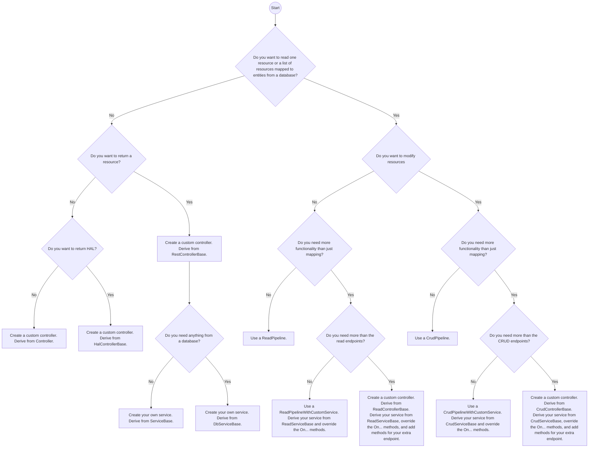

# Choosing a Pipeline

RESTworld is highly configurable and offers multiple pipelines for different scenarios. If you are unsure which option fits best, start with the [Pipeline Overview](pipeline-overview.md) for context, then use the flowchart below to pick the right implementation strategy.

