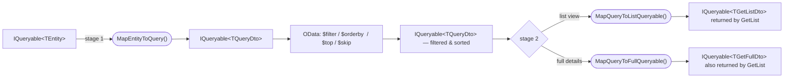

# DTO Types and Roles

RESTworld uses a fixed set of Data Transfer Object (DTO) types to move data through each pipeline. Each type serves a distinct role and maps to a specific stage of the request lifecycle. Understanding what each type is for — and in particular the special role of `TQueryDto` — will help you design clean, efficient APIs.

## Base classes

All RESTworld DTOs are plain C# classes. Three optional base classes add standard infrastructure properties:

| Base class | Adds | Use when |
|---|---|---|
| *(none)* | – | The client supplies all data; no identity from the database yet (create operations) |
| `DtoBase` | `Id` | The record exists in the database and needs to be identified |
| `ConcurrentDtoBase` | `Id`, `Timestamp` | The record may be concurrently edited and needs optimistic concurrency checks |
| `ChangeTrackingDtoBase` | `Id`, `Timestamp`, `CreatedAt`, `CreatedBy`, `LastChangedAt`, `LastChangedBy` | The record should expose full audit information |

> `ChangeTrackingDtoBase` extends `ConcurrentDtoBase`, which extends `DtoBase`.

## DTO roles in a CRUD pipeline

A full CRUD pipeline is typed with six generic parameters:

```
TEntity, TCreateDto, TQueryDto, TGetListDto, TGetFullDto, TUpdateDto
```

### `TCreateDto` — sent by the client when creating a record

`TCreateDto` contains only the fields that the client provides when creating a new record. It does **not** derive from any base class, because the record does not yet have an identity, a timestamp, or audit fields — those are assigned by the server after insertion.

```csharp
public class PostCreateDto
{
    [Display(Name = "Author")]
    public long AuthorId { get; set; }

    [Display(Name = "Blog")]
    public long BlogId { get; set; }

    [Required]
    public string Headline { get; set; } = default!;

    public PostState State { get; set; }

    [DataType(DataType.MultilineText)]
    [Required]
    public string Text { get; set; } = default!;

    // Navigation property — used for HAL-Forms options generation (see below)
    [JsonIgnore]
    public AuthorDto? Author { get; set; }

    [JsonIgnore]
    public BlogGetListDto? Blog { get; set; }
}
```

> The mapper must **ignore** all entity-side infrastructure properties (`Id`, `CreatedAt`, `CreatedBy`, `LastChangedAt`, `LastChangedBy`, `Timestamp`) when mapping `TCreateDto` → `TEntity`.

---

### `TUpdateDto` — sent by the client when updating a record

`TUpdateDto` extends `ConcurrentDtoBase` so it carries an `Id` and a `Timestamp`. The `Id` identifies which record to update and the `Timestamp` is used for optimistic concurrency: if the record was changed by someone else since it was last read, the server rejects the update.

```csharp
public class PostUpdateDto : ConcurrentDtoBase
{
    [Display(Name = "Author")]
    public long AuthorId { get; set; }

    [Display(Name = "Blog")]
    public long BlogId { get; set; }

    [Required]
    public string Headline { get; set; } = default!;

    public PostState State { get; set; }

    [Required]
    [DataType(DataType.MultilineText)]
    public string Text { get; set; } = default!;
}
```

> The mapper must **ignore** all infrastructure properties except `Id` and `Timestamp` when mapping `TUpdateDto` → `TEntity`.

---

### `TGetListDto` — returned for each item in a list response

`TGetListDto` extends `ChangeTrackingDtoBase` and contains only the fields that are useful in a compact list view. It is the type exposed by the `GetList` endpoint and is also used as the target type for OData queries after OData has been applied (see `TQueryDto` below).

Keep `TGetListDto` lean: exclude large text blobs and fields that do not help users identify or sort rows.

```csharp
public class PostListDto : ChangeTrackingDtoBase
{
    public required string Headline { get; set; }

    [Display(Name = "Author")]
    public long AuthorId { get; set; }

    [Display(Name = "Blog")]
    public long BlogId { get; set; }

    // Navigation properties — used for HAL-Forms options generation (see below)
    [JsonIgnore]
    public virtual AuthorDto? Author { get; set; }

    [JsonIgnore]
    public virtual BlogGetFullDto? Blog { get; set; }
}
```

> Every registered pipeline automatically calls `AddForeignKeyForFormTo<TGetListDto>()`, which registers the list endpoint as a potential target for HAL-Forms foreign-key options. See [Foreign keys and HAL-Forms](#foreign-keys-and-hal-forms) below.

---

### `TGetFullDto` — returned when fetching a single record

`TGetFullDto` extends `ChangeTrackingDtoBase` and includes all fields that are relevant for a detail view. It is used by both the `Get` endpoint (after fetching the entity by id) and after OData has been applied on the `GetList` endpoint when the client requests full details.

```csharp
[HasHistory]          // optional — signals that this entity has a history endpoint
public class PostGetFullDto : ChangeTrackingDtoBase
{
    [Display(Name = "Author")]
    public long AuthorId { get; set; }

    [Display(Name = "Blog")]
    public long BlogId { get; set; }

    [Required]
    public string Headline { get; set; } = default!;

    public PostState State { get; set; }

    [Required]
    [DataType(DataType.MultilineText)]
    public string Text { get; set; } = default!;

    // Navigation properties — used for HAL-Forms options generation (see below)
    [JsonIgnore]
    public virtual AuthorDto? Author { get; set; }

    [JsonIgnore]
    public virtual BlogGetFullDto? Blog { get; set; }
}
```

---

### `TQueryDto` — the OData intermediary

`TQueryDto` is the most distinctive type in the pipeline. It acts as an **intermediate representation** that exists solely to support efficient OData queries. It is never sent to or received from the client directly.

#### Why TQueryDto exists

OData query options (`$filter`, `$orderby`, `$top`, `$skip`) are applied to an `IQueryable<T>` in the database layer. For filtering and sorting to work correctly across related data, `TQueryDto` must expose all properties that a client may want to filter or sort on — **including navigation properties that load related entities via EF Core joins**.

Mapping is therefore done in **two stages**:



The stage-1 projection (`MapEntityToQuery`) includes navigation properties so that OData can generate the correct SQL joins. Each stage-2 projection then drops those navigation properties — they are not needed in the response — to keep the final query lean.

#### TQueryDto example

```csharp
public class PostQueryDto : ChangeTrackingDtoBase
{
    // Scalar properties — can be filtered and sorted by OData
    public long AuthorId { get; set; }
    public long BlogId { get; set; }
    public string Headline { get; set; } = default!;
    public PostState State { get; set; }
    public string Text { get; set; } = default!;

    // Navigation properties — included so OData can filter on Author.LastName, Blog.Name etc.
    public virtual AuthorDto? Author { get; set; }
    public virtual BlogGetFullDto? Blog { get; set; }
}
```

> Notice that `TQueryDto` does **not** use `[JsonIgnore]` on its navigation properties. They need to be visible to the OData expression translator. It is the stage-2 mapper's job to drop them from the final projection.

#### Mapper responsibilities for TQueryDto

For the complete reference of mapper methods and their responsibilities, see [Mapping and Versioning — Mapper method reference](mapping-and-versioning.md#mapper-method-reference).

## Foreign keys and HAL-Forms

RESTworld uses the navigation properties on your DTOs to automatically generate [HAL-Forms](https://rwcbook.github.io/hal-forms/) `options` elements. These tell the Angular client (or any HAL-Forms-aware consumer) where to fetch the list of valid values for a foreign-key field, enabling it to render a dropdown or autocomplete.

### How it works

Every pipeline registration automatically calls:

```csharp
services.AddForeignKeyForFormTo<TGetListDto>();
```

This registers a `CrudForeignKeyLinkFactory<TGetListDto>` for each pipeline, which points to the `GetList` endpoint of that pipeline's controller. When RESTworld generates a HAL-Forms document for a DTO that has a foreign-key property, it inspects the property's navigation counterpart, finds the registered factory whose `TListDto` matches, and emits an `OptionsLink` in the form field.

### How the navigation property is resolved

RESTworld (via the underlying HAL-Forms library) uses two mechanisms to connect an ID property to its companion navigation property:

#### By convention — `Id` suffix

If a property's name ends with `Id` (case-insensitive), the framework strips the suffix and looks for a navigation property with the remaining name on the same type:

| ID property | Navigation property found |
|---|---|
| `AuthorId` | `Author` |
| `BlogId` | `Blog` |
| `PostId` | `Post` |

This means you only need to add the navigation property with the matching name — no attribute required.

#### Explicit override — `[ForeignKey]`

When the ID property's name does not end with `Id` (e.g. a collection of IDs like `BlogIds`), or when the navigation property name differs from the stripped convention, place `[ForeignKey(nameof(NavigationProperty))]` on the **ID property**:

```csharp
// BlogIds ends with 's', not 'Id' — the convention cannot resolve it
[ForeignKey(nameof(Blogs))]
[DisplayName("Blogs")]
public required IReadOnlyCollection<long> BlogIds { get; set; }

[JsonIgnore]
public virtual ICollection<BlogGetListDto>? Blogs { get; }
```

### Navigation properties must be nullable

Navigation properties on DTOs **must always be declared nullable** (with `?`). Because they are decorated with `[JsonIgnore]`, they are never populated during deserialization. If the property is non-nullable, the deserializer will throw an exception when the value is absent.

```csharp
// ✓ Correct — nullable
[JsonIgnore]
public virtual AuthorDto? Author { get; set; }

// ✗ Wrong — will throw during deserialization
[JsonIgnore]
public virtual AuthorDto Author { get; set; } = default!;
```

### Requiredness of the form field

Whether the foreign-key field is marked as required in the generated HAL-Forms document is determined by the **ID property**, not the navigation property:

- If the ID property is **non-nullable** (e.g. `long AuthorId`), the field is required.
- If the ID property has a `[Required]` attribute, the field is required regardless of nullability.
- If the ID property is **nullable** (e.g. `long? AuthorId`), the field is optional.

```csharp
// Required in the form — non-nullable id
[Display(Name = "Author")]
public long AuthorId { get; set; }

// Optional in the form — nullable id
[Display(Name = "Category")]
public long? CategoryId { get; set; }
```

### The navigation property pattern — complete example

```csharp
public class PostGetFullDto : ChangeTrackingDtoBase
{
    // Required in the form (non-nullable long)
    [Display(Name = "Author")]
    public long AuthorId { get; set; }

    // Navigation property resolved by convention: "AuthorId" → "Author"
    // Must be nullable; excluded from serialization
    [JsonIgnore]
    public virtual AuthorDto? Author { get; set; }

    // Optional in the form (nullable long?)
    [Display(Name = "Category")]
    public long? CategoryId { get; set; }

    // Navigation property resolved by convention: "CategoryId" → "Category"
    [JsonIgnore]
    public virtual CategoryDto? Category { get; set; }
}
```

> **Convention:** always match the navigation property type to the `TGetListDto` registered for the target resource's pipeline, not to a heavier DTO such as `TGetFullDto`. This avoids loading unnecessary data and ensures the factory resolves correctly.

### Multi-value foreign keys

When a record references multiple items of the same type (a many-to-many relationship), use a collection of IDs. Because the property name (`BlogIds`) ends with `s` rather than `Id`, the convention cannot resolve it — use `[ForeignKey]` explicitly:

```csharp
public class TestDto : ConcurrentDtoBase
{
    [ForeignKey(nameof(Blogs))]     // explicit — "BlogIds" does not end in "Id"
    [DisplayName("Blogs")]
    public required IReadOnlyCollection<long> BlogIds { get; set; }

    [JsonIgnore]
    public virtual ICollection<BlogGetListDto>? Blogs { get; }  // must be nullable
}
```

### Registration is automatic for standard pipelines

For standard `AddCrudPipeline` and `AddReadPipeline` calls, `AddForeignKeyForFormTo<TGetListDto>()` is called automatically. You only need to call it explicitly when:

- You build a fully custom service without using the pipeline extension methods, **or**
- You want to register an additional type that is not the `TGetListDto` of any registered pipeline (e.g. to support a polymorphic navigation property).

```csharp
// Only needed for custom setups
builder.AddForeignKeyForFormTo<BlogGetListDto>();
```

## Data annotations for form generation

RESTworld reads standard `System.ComponentModel.DataAnnotations` attributes — plus a few of its own — from your DTO properties to generate HAL-Forms field descriptors. The following annotations influence form rendering:

| Attribute | Effect |
|---|---|
| `[Required]` | Marks the field as required |
| `[Display(Name = "...")]` | Sets the human-readable label |
| `[Display(Order = ...)]` | Controls the ordering of fields in the form |
| `[DisplayColumn(nameof(Prop))]` | Identifies the display property when this DTO is used as a lookup target |
| `[Editable(false)]` | Renders the field as read-only |
| `[DataType(DataType.MultilineText)]` | Renders the field as a multi-line text area |
| `[DataType(DataType.ImageUrl)]` | Renders the field as an image upload / URL |
| `[DataType(DataType.Upload)]` | Renders the field as a file upload |
| `[MaxLength(n)]` | Adds a max-length constraint to the field |
| `[Range(min, max)]` | Adds a numeric range constraint |
| `[ForeignKey(nameof(Nav))]` | Links an ID property to its navigation property by name when the `Id`-suffix convention cannot resolve it automatically |
| `[HasHistory]` | (class-level) Signals that this resource has a history endpoint |
| `[RestWorldImage(...)]` | Configures an image-cropper field with aspect ratio and resize options |
| `[JsonIgnore]` | Excludes the property from serialization (use on navigation properties) |

## Summary

| DTO type | Sent by | Received by | Base class | Purpose |
|---|---|---|---|---|
| `TCreateDto` | Client | Server | *(none)* | Carries the data for a new record |
| `TUpdateDto` | Client | Server | `ConcurrentDtoBase` | Carries updated data + concurrency token |
| `TQueryDto` | *(internal)* | *(internal)* | `ChangeTrackingDtoBase` | OData-queryable intermediate representation |
| `TGetListDto` | Server | Client | `ChangeTrackingDtoBase` | Compact representation for list views |
| `TGetFullDto` | Server | Client | `ChangeTrackingDtoBase` | Full representation for detail views |

For the mapper registration patterns that connect these types, see [Mapping and Versioning](mapping-and-versioning.md). For the overall request flow, see [Pipeline Overview](pipeline-overview.md).
